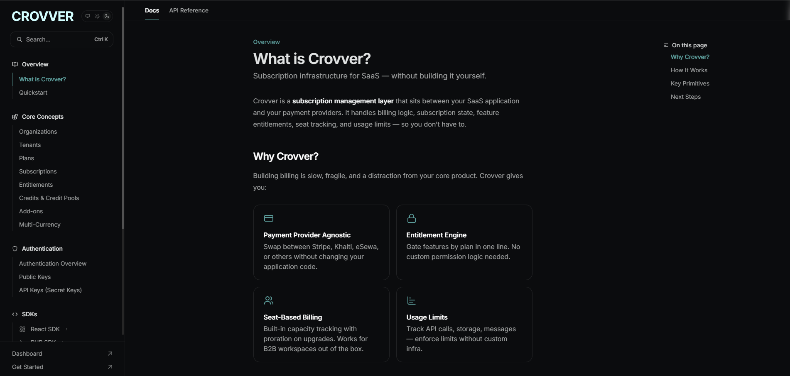

## 1. Crovver API Testing



## 2. Project Overview

This project focuses on testing REST APIs using Postman. The API test suite covers functional validation of API endpoints, request and response validation, status code verification, and negative test scenarios.

## 3. Application Under Test

- **API:** [Name of the API/Application]
- **Type:** REST API
- **Testing Tool:** Postman

## 4. Objectives

- Validate API endpoints and their expected behavior
- Verify HTTP status codes
- Validate response body and response structure
- Test positive and negative scenarios
- Verify request parameters and payloads
- Validate API error handling
- Verify response time

## 5. API Test Coverage

| Method | Endpoint / Test |
|---|---|
| GET | Get Tenant |
| GET | Get Subscription Status |
| POST | Create Tenant |
| POST | Create Tenant - Server Error |
| GET | Get Plans |
| GET | Get Available Add-ons |
| GET | Get Credit Balance |
| POST | Cancel Subscription |

## 6. Testing Performed

- Status code validation
- Response body validation
- Positive API testing
- Negative API testing
- Error response validation
- Request payload validation

## 7. Test Assertions

The following validations were performed using Postman:

- HTTP status code
- Response body
- Response fields
- Response data
- Response time
- Expected error messages

## 8. Postman Collection

The complete Postman collection is available in:

`Crovver.postman_collection.json`

## 9. Project Structure

```text
Crovver/
├── Crovver.postman_collection.json
├── images/
│   ├── crovver.png
└── README.md
```

